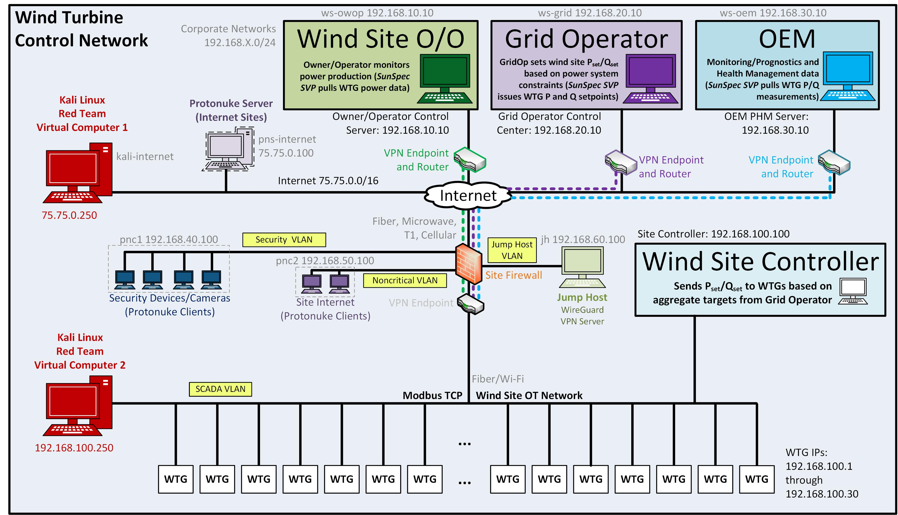
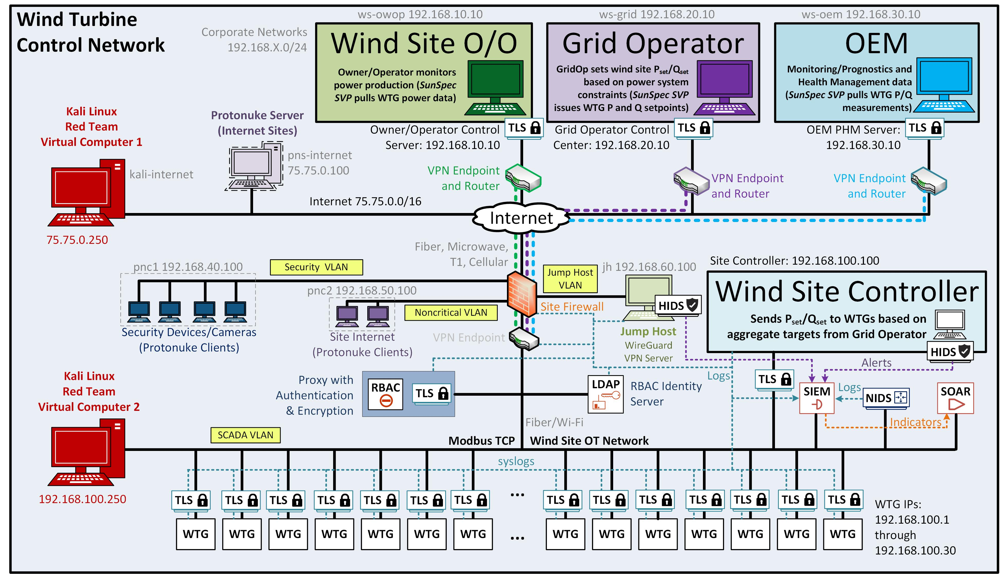

# Wind Architecture

## Wind Turbine Control Network

Two primary architectures are included in the four topologies found in `phenix-configs`:

`base` is as it sounds, the base topology which is common across the remaining three topologies. The four primary networks include the Wind Site owner/operator, the Grid operator, OEM, and wind site. Each of the networks illustrated on the top of Figure 1 have independent IPSEC VPN connections to the wind plant network. There are three Protonuke VMs used for generating http, https, and smtp traffic to represent internet based noise in the simulation. Figure 1 includes 30 VMs representing wind turbine generators (WTGs), however, the topology only includes five VMs. One VM, `guard-cli`, is a Wireguard client which represents the laptop of an OEM technician is not represented on the illustration but is included in the topology.

Notes:

- It is possible to have any number of WTGs provided the hardware running minimega and phēnix have the resources to support them.

- We are using protonuke server on the WTGs and protonuke clients on the workstations generating http traffic to simiulate OT traffic.

`hids` is `base` plus host-based IDS &mdash; Wazuh.

`nids` is `base` plus network IDS &mdash; Zeek.

`soar` is `base` plus `hids` plus `nids` &mdash; we have included a VM for SOAR but it is not running a SOAR solution.

Figure 2 illustrates these three networks in a single image.

